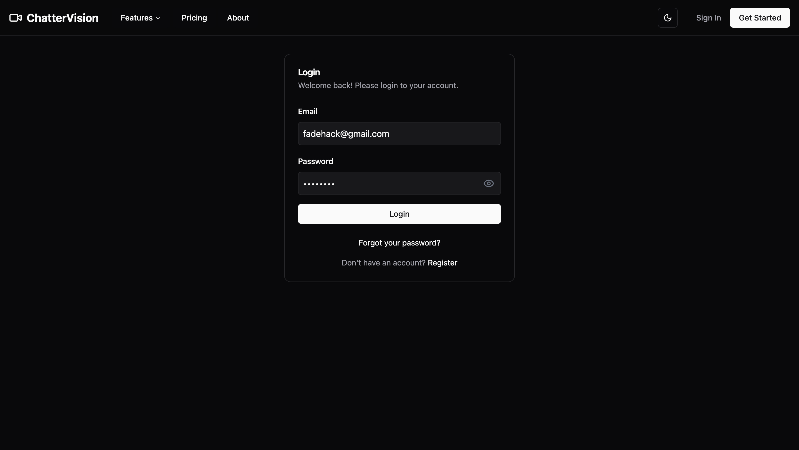
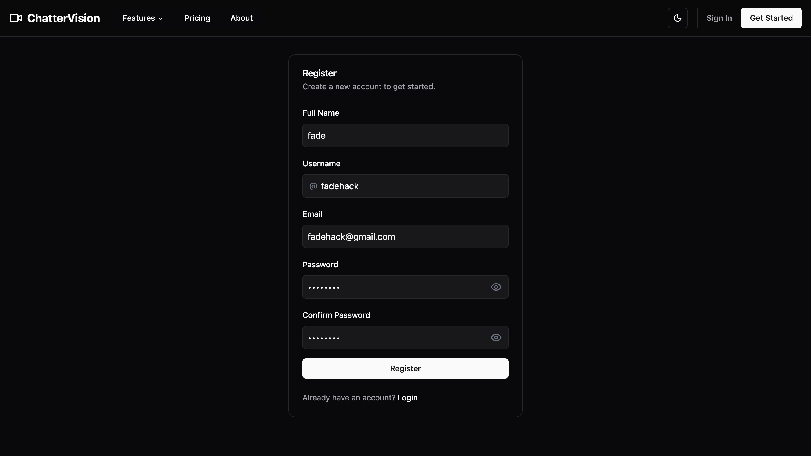

# ChatterVision

## Overview

Chattervision is a real-time video conferencing application designed to provide a seamless and intuitive meeting experience. It allows multiple users to join a video call, communicate via video and audio, and interact with various in-call features. The application is built with a modern tech stack, ensuring reliability, scalability, and a user-friendly interface.

## Table of Contents

- [Technologies Used](#technologies-used)
- [Features](#features)
- [Screenshots](#screenshots)
- [How to Run](#how-to-run)
- [License](#license)

## Technologies Used

### Frontend

- **React:** A JavaScript library for building user interfaces.
- **Vite:** A fast build tool and development server for modern web projects.
- **Zustand:** A small, fast, and scalable bearbones state-management solution.
- **Socket.io-client:** For real-time, bidirectional event-based communication.
- **simple-peer:** For simplified WebRTC peer-to-peer data channels.
- **lucide-react:** A library of simply beautiful icons.
- **Tailwind CSS:** A utility-first CSS framework for rapid UI development.
- **Shadcn/ui:** A set of accessible and customizable components for building user interfaces.

### Backend

- **Node.js:** A JavaScript runtime built on Chrome's V8 JavaScript engine.
- **Express.js:** A minimal and flexible Node.js web application framework.
- **Socket.io:** For enabling real-time, bidirectional and event-based communication.
- **Passport.js (with JWT strategy):** Authentication middleware for Node.js.
- **Winston:** A logger for just about everything.
- **Helmet:** Helps secure Express apps by setting various HTTP headers.
- **CORS:** For enabling Cross-Origin Resource Sharing.
- **MongoDB (implied by Mongoose):** A NoSQL database for storing application data.
- **Mongoose:** An Object Data Modeling (ODM) library for MongoDB and Node.js.

## Features

- **Real-time Video and Audio:** High-quality, low-latency video and audio communication.
- **Multi-user Conferencing:** Support for multiple participants in a single call.
- **Authentication:** Secure user authentication using JWT and Passport.js.
- **In-call Controls:** Mute/unmute audio, turn on/off video.
- **Participant Management:** View the list of participants in the call.
- **Host Controls:** The host has the ability to end the call for all participants.
- **Responsive Design:** A user interface that adapts to different screen sizes.

## Screenshots

### Homepage (Dark and Light Mode)

| Dark Mode | Light Mode |
| :---: | :---: |
|  |  |

### Authentication

| Login Page | Register Page |
| :---: | :---: |
|  |  |

### Dashboard

| Dashboard(Dark) | Dashboard(Light) |
| :---: | :---: |
|  |  |

### Video Call

| Create Video Call | Video Call |
| :---: | :---: |
|  |  |

## How to Run

### Prerequisites

- Node.js (v14 or higher)
- npm or yarn
- MongoDB instance (local or remote)

### Backend Setup

1.  **Clone the repository:**
    ```bash
    git clone https://github.com/fadehack/chatter-vision.git
    cd chatter-vision/backend
    ```

2.  **Install dependencies:**
    ```bash
    npm install
    ```

3.  **Copy .env.example to a `.env` file** in the `backend` directory and update the environment variables to actual values:
    ```env
    PORT=3000
    MONGODB_URL=your_mongodb_connection_string
    JWT_SECRET=your_jwt_secret
    JWT_ACCESS_EXPIRATION_MINUTES=30
    JWT_REFRESH_EXPIRATION_DAYS=30
    FRONTEND_URL=http://localhost:3000
    .......
    ....
    ..
    ```

4.  **Start the backend server:**
    ```bash
    npm run dev
    ```

### Frontend Setup

1.  **Navigate to the frontend directory:**
    ```bash
    cd ../frontend
    ```

2.  **Install dependencies:**
    ```bash
    npm install
    ```

3.  **Create a `.env` file** in the `frontend` directory and add the following:
    ```env
    VITE_API_BASE_URL=http://localhost:3000
    VITE_SOCKET_URL=http://localhost:3000
    ```

4.  **Start the frontend development server:**
    ```bash
    npm start
    ```

5.  Open your browser and navigate to `http://localhost:3000`.

## License

This project is licensed under the MIT License - see the [LICENSE](LICENSE) file for details.